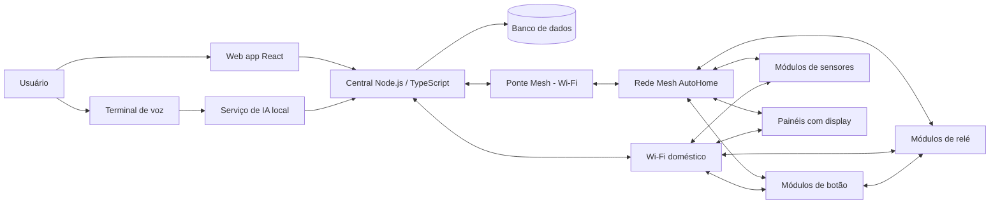

# Arquitetura do Projeto AutoHome

O AutoHome é uma plataforma de automação residencial local, modular e distribuída. Ela permite controlar iluminação, relés, botões, sensores, displays e outros dispositivos sem depender de serviços externos ou de uma central para as automações essenciais.

A casa funciona como uma rede de dispositivos autônomos: cada módulo conhece sua própria função, pode conversar diretamente com outros módulos e continua operando quando a central, a internet ou o serviço de IA estiverem indisponíveis. A central adiciona gestão, visibilidade, histórico, automações avançadas e interfaces para o usuário.

## Princípios

- **Local em primeiro lugar:** comandos e automações críticas não dependem de internet, nuvem ou LLM.
- **Sem ponto único de falha:** a indisponibilidade da central não pode impedir um botão de controlar sua luz associada, seja o módulo conectado via Mesh ou via Wi-Fi doméstico direto.
- **Modularidade:** o mesmo firmware-base atende tipos diferentes de módulos por meio de capacidades e configuração.
- **Interoperabilidade:** módulos, central, interface web e assistente de IA compartilham contratos e um protocolo bem definido.
- **Segurança por padrão:** somente dispositivos e usuários autorizados podem entrar na rede, enviar comandos ou atualizar firmware.
- **Evolução segura:** configurações e firmware devem poder ser atualizados gradualmente, com validação e possibilidade de recuperação.

## Visão da Arquitetura

Um módulo opera em um dos dois transportes, Mesh ou Wi-Fi doméstico, mas o protocolo de mensagens é o mesmo nos dois casos. Módulos em Wi-Fi direto falam com a central sem passar pela ponte.

Há dois planos complementares:

1. **Plano operacional distribuído:** a comunicação direta entre módulos, por Mesh ou por Wi-Fi doméstico. Ela entrega eventos, comandos e estados diretamente entre os dispositivos e mantém as funções básicas da casa disponíveis, independentemente do transporte usado.
2. **Plano de gestão:** a central conectada à Mesh por uma ponte, ou diretamente ao Wi-Fi doméstico. Ela configura dispositivos, registra histórico, coordena atualizações, expõe APIs e serve a interface web e o assistente de IA.

## Componentes

### Módulos ESP32

Os módulos são instalados nas caixas elétricas, próximos às cargas ou em pontos de interação da casa. Cada módulo anuncia suas capacidades e recebe uma configuração que define seu comportamento e seus vínculos com outros módulos.

Cada módulo opera em um transporte de rede, Mesh ou Wi-Fi doméstico, declarado como parte de suas capacidades. O protocolo de mensagens é idêntico nos dois casos; muda apenas o meio de transporte. Módulos em Wi-Fi doméstico devem continuar capazes de se descobrir e se comunicar diretamente entre si na rede local, sem depender da central, preservando o mesmo comportamento de vínculo direto que a Mesh oferece.

Capacidades iniciais esperadas:

- Entrada de botão, interruptor e contato seco.
- Saída de relé para ligar e desligar cargas.
- Medição de consumo elétrico, quando houver hardware compatível.
- Sensores de temperatura, umidade, presença, luminosidade e outros.
- Controle de LEDs, incluindo estado, cor e intensidade quando aplicável.
- Interface local para pareamento, diagnóstico e recuperação.

Exemplos de configurações:

- Um módulo de botão publica um evento e comanda diretamente o relé de uma lâmpada.
- Um módulo de relé recebe comandos da Mesh e mede o consumo da carga ligada.
- Um módulo misto combina entradas de interruptor e saídas de relé.
- Um módulo de sensores publica leituras periódicas ou por mudança significativa.
- Um painel com display, baseado em Raspberry Pi ou ESP32, apresenta estados e envia comandos para a rede.

A associação entre um evento e uma ação deve ser configurável. Por exemplo, o botão da sala pode controlar diretamente a luz da sala, acionar uma cena ou apenas notificar a central, sem exigir firmware diferente para cada caso.

### Rede Mesh AutoHome

A rede Mesh é independente do Wi-Fi doméstico e de provedores externos. Seus dispositivos encaminham mensagens entre si quando necessário, permitindo cobertura distribuída pela residência.

O protocolo deve ser compacto, versionado e independente do meio de transporte. Ele funciona tanto sobre Mesh quanto sobre Wi-Fi doméstico sem alterar a semântica dos comandos, permitindo que um módulo opere em qualquer um dos dois transportes.

Nesta fase inicial de implantação, com poucos módulos instalados, a Mesh ainda não é viável e os módulos se conectam diretamente ao Wi-Fi doméstico. Nesse modo, o vínculo direto entre módulos, como botão e relé, continua obrigatório: os módulos devem se descobrir e trocar mensagens entre si na rede Wi-Fi local sem depender da central. O mecanismo de descoberta direta em Wi-Fi, por exemplo broadcast ou mDNS, será definido na implementação do firmware.

Tipos de mensagens essenciais:

- Descoberta, pareamento e anúncio de capacidades.
- Evento de entrada, como pressionamento de botão ou mudança de sensor.
- Comando para uma capacidade, como ligar relé ou alterar cor de LED.
- Publicação e consulta de estado.
- Configuração de associações, cenas e parâmetros do módulo.
- Telemetria, diagnóstico e logs.
- Transferência de firmware e confirmação de atualização.

Cada mensagem deve incluir, no mínimo, versão do protocolo, identificador de origem, destino ou grupo — sempre um texto legível, nunca o MAC ou o IP do dispositivo —, tipo, identificador de correlação quando houver resposta e proteção de integridade/autenticação. A especificação detalhada do protocolo está em `docs/protocol.md`.

### Ponte Mesh - Wi-Fi

Um módulo especial conecta a rede Mesh ao Wi-Fi/IP da casa. O lado Mesh da ponte precisa ser um ESP32 rodando a pilha de Mesh da Espressif; o lado Wi-Fi pode rodar em qualquer hardware compatível, incluindo um ESP32 dedicado acoplado a um Raspberry Pi ou outro computador.

A ponte não toma decisões de automação local. Sua responsabilidade é traduzir e encaminhar mensagens entre a Mesh e a API da central, além de expor diagnóstico da conectividade. A casa continua executando vínculos diretos entre módulos se a ponte parar.

Módulos conectados diretamente ao Wi-Fi doméstico não passam pela ponte; eles falam com a API da central pelo mesmo protocolo usado na Mesh.

### Central

A central executa em um computador local da residência e será composta por uma API Node.js com TypeScript, MongoDB e serviços de processamento. Cada instalação controla uma única residência. Ela é a fonte de verdade para o inventário, as configurações desejadas, os usuários e o histórico, mas não substitui o estado operacional mantido pelos módulos.

Responsabilidades:

- Descobrir e cadastrar módulos por meio da ponte.
- Manter inventário de dispositivos, capacidades, ambientes, grupos e cenas.
- Ler estados e telemetria; persistir histórico, eventos e logs.
- Enviar comandos administrativos e comandos solicitados pelas interfaces.
- Criar, versionar, validar e distribuir configurações.
- Agendar ações, como desligar luzes em determinado horário.
- Gerenciar atualizações OTA de firmware, incluindo progresso, falhas e recuperação. A central identifica o firmware pelo hash SHA-256 do binário local e compara-o ao hash informado pelo módulo; atualizações podem ser individuais ou em lote.
- Aplicar autenticação, autorização e trilha de auditoria. A primeira versão tem os papéis `basico`, para consulta e comandos operacionais aos módulos, e `administrador`, exclusivo para configurações e administração da central.
- Expor API para a web, terminais de voz e serviço de IA.

O cadastro de usuários é interno, sem dependência de e-mail. Uma instalação nova cria a conta bootstrap `admin` com a senha inicial `admin` e exige a troca de senha antes de permitir comandos ou administração. A interface web usa sessões por cookie seguro; senhas usam hash Argon2id. O MongoDB não é exposto publicamente. A API e a interface podem ser expostas à internet em etapa futura, sempre sobre HTTPS e sem acesso direto aos módulos ou ao banco.

Agendamentos e automações configurados pela central devem ser sincronizados para os módulos quando puderem ser executados localmente. Assim, automações importantes podem continuar ativas durante uma indisponibilidade temporária da central.

### Interface Web

A interface será uma aplicação React conectada à API Node.js da central. Ela é a ferramenta de operação e administração da residência.

Funcionalidades iniciais:

- Painel com estado atual de ambientes, dispositivos e alertas.
- Controle manual de relés, luzes, cenas e outros atuadores.
- Cadastro, pareamento, nomeação e organização dos módulos por ambiente.
- Configuração de associações locais, grupos, cenas e parâmetros dos dispositivos.
- Criação e acompanhamento de agendamentos e automações.
- Visualização de sensores, consumo, eventos, logs e saúde da rede.
- Acompanhamento de atualização de firmware e configuração.
- Gestão de usuários, perfis e permissões.

A interface deve exibir claramente quando um estado é confirmado pelo módulo, quando está pendente e quando um dispositivo está indisponível.

### Serviço de IA e voz

O assistente de IA é um serviço local integrado à central. Ele interpreta solicitações em texto ou voz, consulta o contexto permitido e usa ferramentas controladas para executar ações na casa. Modelos locais, como os servidos pelo Ollama, são uma opção inicial para preservar privacidade e funcionamento sem internet.

A IA não fala diretamente com a Mesh. Ela solicita ações à API da central, que valida identidade, autorização, dispositivos-alvo e regras de segurança antes de encaminhar o comando à ponte.

O serviço deve suportar:

- Conversa por texto e voz.
- Consulta de estados, histórico e dados de sensores autorizados.
- Execução de comandos, cenas e agendamentos por meio de ferramentas tipadas.
- Confirmação de ações ambíguas, sensíveis ou potencialmente perigosas.
- Resposta por voz e texto com o resultado confirmado pela central.

Terminais de voz distribuídos pela casa podem ser implementados com Raspberry Pi, ESP32 ou hardware semelhante. Eles capturam áudio, enviam-no pelo Wi-Fi doméstico ao serviço de IA e reproduzem a resposta. Um terminal deve conseguir informar indisponibilidade do serviço de IA sem interferir nas automações locais.

## Fluxos Principais

### Acionamento local de uma lâmpada

1. O módulo de botão detecta o acionamento físico.
2. Ele publica um evento diretamente para o módulo de relé associado, pela Mesh ou pelo Wi-Fi doméstico, conforme o transporte configurado.
3. O relé altera a carga e publica seu estado confirmado.
4. Quando disponível, a ponte (no caso da Mesh) ou a própria central (no caso do Wi-Fi direto) recebe o evento e o estado para histórico e atualização da interface.

Esse fluxo não exige a central, o serviço de IA ou internet. No modo Wi-Fi direto, ele depende apenas do Wi-Fi doméstico estar operacional entre os dois módulos.

### Comando pela interface web

1. O usuário envia um comando na aplicação React.
2. A API da central autentica o usuário, valida sua permissão e registra a solicitação.
3. A central envia a mensagem à ponte, que a encaminha pela Mesh.
4. O módulo executa o comando e publica a confirmação de estado.
5. A central atualiza o banco de dados e envia o resultado em tempo real à interface.

### Comando por voz

1. O terminal de voz captura a fala e a envia pelo Wi-Fi ao serviço local de IA.
2. A IA interpreta a intenção e chama uma ferramenta da API da central, por exemplo, `ligar_dispositivo`.
3. A central valida o pedido e o encaminha pela ponte à Mesh.
4. Após receber a confirmação do módulo, a central devolve o resultado à IA.
5. O terminal reproduz uma resposta de voz baseada no resultado confirmado.

### Atualização de firmware

1. Um administrador inicia a atualização de um módulo, de uma família ou de todos os módulos elegíveis.
2. A central seleciona o binário local da família compatível, registra seu hash SHA-256 e executa a atualização em fila e lotes pequenos.
3. A imagem é distribuída com progresso por dispositivo pela ponte e pela Mesh quando aplicável.
4. Cada módulo valida o hash da imagem, reinicia e informa seu hash de firmware atual; a central só confirma a atualização se o hash esperado for recebido.
5. A central registra o resultado, mantém falhas isoladas no lote e destaca módulos que exigem nova tentativa ou intervenção.

## Framework e Contratos

O framework define as bibliotecas e padrões comuns usados por todos os módulos. Ele deve fornecer:

- Modelo de identidade e pareamento seguro.
- Registro de capacidades e configuração declarativa.
- Serialização compacta de mensagens.
- Roteamento, confirmação, repetição limitada e deduplicação de mensagens.
- Modelo uniforme de estado, evento, comando, erro e telemetria.
- Persistência local mínima para configurações e vínculos essenciais.
- APIs para drivers de hardware, como botão, relé e sensores.
- Testes de compatibilidade entre versões de firmware e protocolo.

O framework deve distinguir comandos idempotentes, como definir um relé como ligado, de comandos baseados em evento, como alternar estado. Para operações críticas, preferir comandos idempotentes e confirmação explícita de estado.

## Limites e Decisões Iniciais

- Os módulos podem operar em Mesh ou em Wi-Fi doméstico como transporte, com o mesmo protocolo de mensagens nos dois casos. O Wi-Fi doméstico também atende a central, a web e os terminais de voz.
- A ponte é uma integração de rede, não o controlador obrigatório da casa, e só se aplica a módulos em Mesh.
- A central é local por padrão. Integrações externas podem ser adicionadas posteriormente como opção explícita.
- A IA é uma interface de alto nível e não substitui regras determinísticas de automação.
- A implantação inicial usa módulos conectados diretamente ao Wi-Fi doméstico, sem depender da Mesh; a Mesh é adotada conforme a quantidade de módulos instalados cresce.
- A primeira versão deve priorizar botão, relé, estado, pareamento, configuração de vínculos diretos e ponte com a central antes de sensores avançados, displays, OTA em malha e voz.

## Critérios de Sucesso da Primeira Versão

- Um botão associado a um relé controla a carga sem central ou internet.
- A central detecta os módulos, apresenta seus estados e envia comandos pela ponte.
- A interface web permite organizar ambientes e controlar dispositivos cadastrados.
- Configurações de vínculos locais sobrevivem à reinicialização dos módulos.
- O sistema informa falhas de comunicação e não apresenta comandos como concluídos sem confirmação.
- O assistente de IA consegue consultar o estado de um ambiente e executar um comando autorizado por voz ou texto.